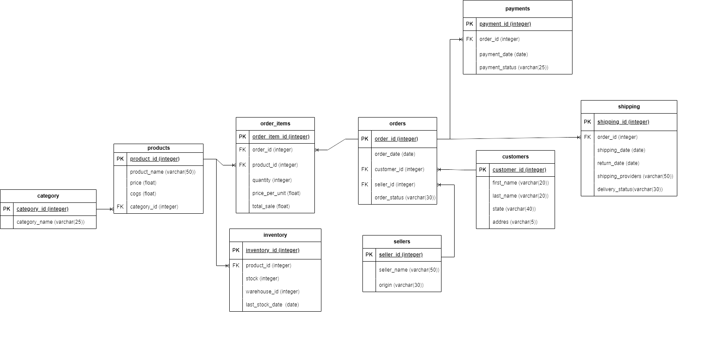

# **E-Commerce Sales Analysis Project**

### **Difficulty Level: Advanced**

---

## **Project Overview**

In this project, I explored a dataset of over 20,000 sales records from an e-commerce platform, diving deep into customer behavior, product performance, and overall sales trends using PostgreSQL.

Throughout the analysis, I tackled key business challenges such as revenue tracking, customer segmentation, and inventory optimization. Additionally, I focused on data cleaning, managing missing values, and crafting structured queries to extract meaningful insights.

To provide a clearer understanding of the database structure, I’ve also included an ERD diagram that visually maps out the relationships between different tables.

### **Database Schema Overview**

The database is structured to capture key aspects of an e-commerce platform, including products, customers, orders, and payments. Below is a high-level breakdown of the schema:

- **Products & Categories**: Products are categorized to allow efficient filtering and analysis of different product types. Each product has attributes like price and cost of goods sold (COGS).  
- **Customers & Sellers**: The database keeps track of customer details (name, address, state) and seller information (origin, name).  
- **Orders & Order Items**: Orders are linked to both customers and sellers. Each order consists of multiple items, with details on quantity and price per unit.  
- **Payments & Shipping**: Payment records store transaction details, while the shipping table tracks delivery status, shipping providers, and return dates.  
- **Inventory Management**: The inventory system monitors product stock levels, warehouse locations, and restocking dates.  

To provide a clear visual representation of the relationships between these tables, refer to the **ERD diagram** below:

# **Advanced Business Problems**

This section outlines 22 advanced SQL challenges designed to analyze and optimize key aspects of e-commerce sales, inventory, and customer behavior.

---

### **1. Top Selling Products**  
Query the top 10 products by total sales value.  
**Challenge:** Include product name, total quantity sold, and total sales value.  

### **2. Revenue by Category**  
Calculate total revenue generated by each product category.  
**Challenge:** Include the percentage contribution of each category to total revenue.  

### **3. Average Order Value (AOV)**  
Compute the average order value for each customer.  
**Challenge:** Include only customers with more than 5 orders.  

### **4. Monthly Sales Trend**  
Query monthly total sales over the past year.  
**Challenge:** Display the sales trend, grouping by month, and return current-month sales, last-month sales.  

### **5. Customers with No Purchases**  
Find customers who have registered but never placed an order.  
**Challenge:** List customer details and the time since their registration.  

### **6. Least-Selling Categories by State**  
Identify the least-selling product category for each state.  
**Challenge:** Include the total sales for that category within each state.  

### **7. Customer Lifetime Value (CLTV)**  
Calculate the total value of orders placed by each customer over their lifetime.  
**Challenge:** Rank customers based on their CLTV.  

### **8. Inventory Stock Alerts**  
Query products with stock levels below a certain threshold (e.g., less than 10 units).  
**Challenge:** Include last restock date and warehouse information.  

### **9. Shipping Delays**  
Identify orders where the shipping date is later than 3 days after the order date.  
**Challenge:** Include customer, order details, and delivery provider.  

### **10. Payment Success Rate**  
Calculate the percentage of successful payments across all orders.  
**Challenge:** Include breakdowns by payment status (e.g., failed, pending).  

### **11. Top Performing Sellers**  
Find the top 5 sellers based on total sales value.  
**Challenge:** Include both successful and failed orders, and display their percentage of successful orders.  

### **12. Product Profit Margin**  
Calculate the profit margin for each product (difference between price and cost of goods sold).  
**Challenge:** Rank products by their profit margin, from highest to lowest.  

### **13. Most Returned Products**  
Query the top 10 products by the number of returns.  
**Challenge:** Display the return rate as a percentage of total units sold for each product.  

### **14. Orders Pending Shipment**  
Find orders that have been paid but are still pending shipment.  
**Challenge:** Include order details, payment date, and customer information.  

### **15. Inactive Sellers**  
Identify sellers who haven’t made any sales in the last 6 months.  
**Challenge:** Show the last sale date and total sales from those sellers.  

### **16. Identifying Returning vs. New Customers**  
Classify customers based on order history:  
- If a customer has made more than 5 purchases, categorize them as **Returning**.  
- Otherwise, classify them as **New**.  
**Challenge:** List customer ID, name, total orders, and total returns.  

### **17. Cross-Sell Opportunities**  
Find customers who purchased Product A but not Product B (e.g., customers who bought AirPods but not AirPods Max).  
**Challenge:** Suggest cross-sell opportunities by displaying matching product categories.  

### **18. Top 5 Customers by Orders in Each State**  
Identify the top 5 customers with the highest number of orders for each state.  
**Challenge:** Include the number of orders and total sales for each customer.  

### **19. Revenue by Shipping Provider**  
Calculate the total revenue handled by each shipping provider.  
**Challenge:** Include the total number of orders handled and the average delivery time for each provider.  

### **20. Declining Product Revenue**  
Find the **top 10** products with the highest revenue decrease when comparing last year (2022) to the current year (2023).  
**Challenge:** Return product ID, product name, category name, 2022 revenue, and 2023 revenue.  
- Calculate the revenue decrease ratio using the formula:  
  **Decrease Ratio = (Last Year Revenue - Current Year Revenue) / Last Year Revenue × 100**  
- Round the final result for clarity.  

---

## **Final Task: Automating Inventory Updates**  

### **Stored Procedure for Inventory Management**  
Create a function that automatically updates stock levels when a product is sold.  

**Requirements:**  
- When a new sales record is added, the function should decrease the corresponding quantity in the inventory table.  
- Ensure stock levels are updated in real-time based on the product and quantity purchased.  

---
